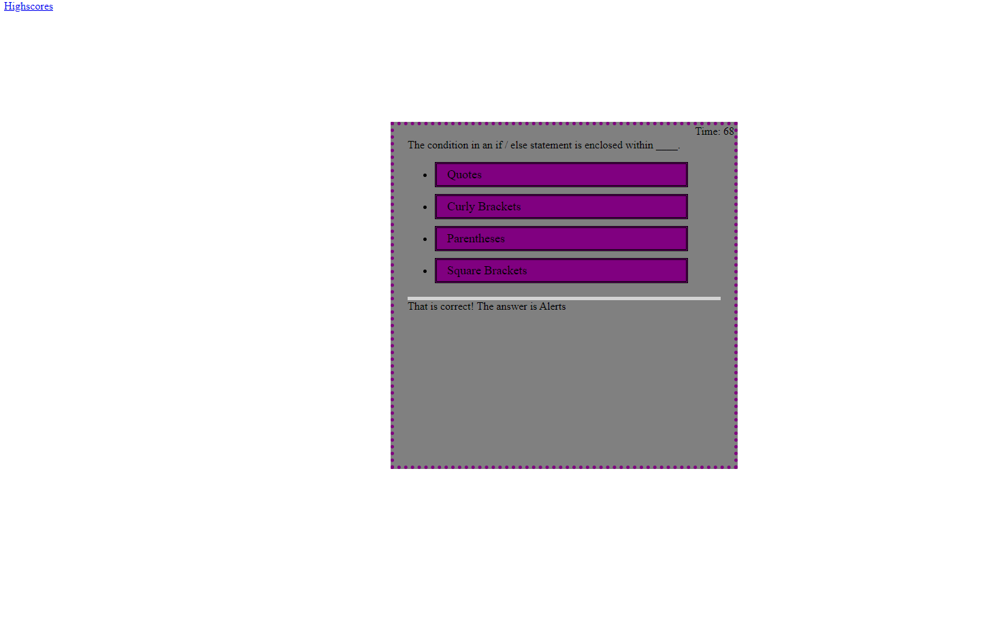

# Coding Test

## Description

The purpose of this assignment was to build a responsive quiz interface with a timer that stores highscores to the local storage.

## Deployed Application

https://am-cowles.github.io/Coding-Test/

## User Story

```
AS A coding boot camp student
I WANT to take a timed quiz on JavaScript fundamentals that stores high scores
SO THAT I can gauge my progress compared to my peers
```

## Screenshot

The following is a screenshot of the fully functional application.

